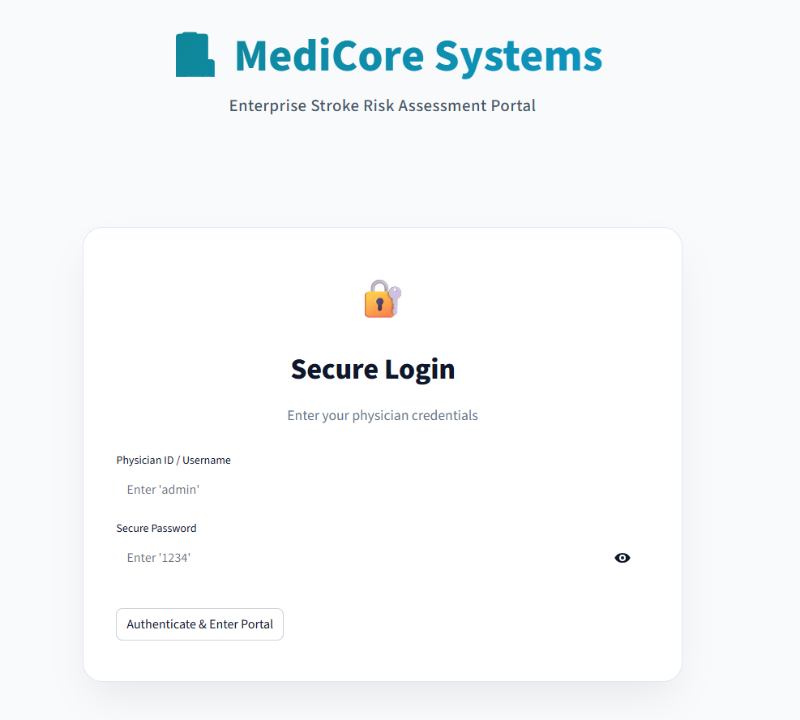
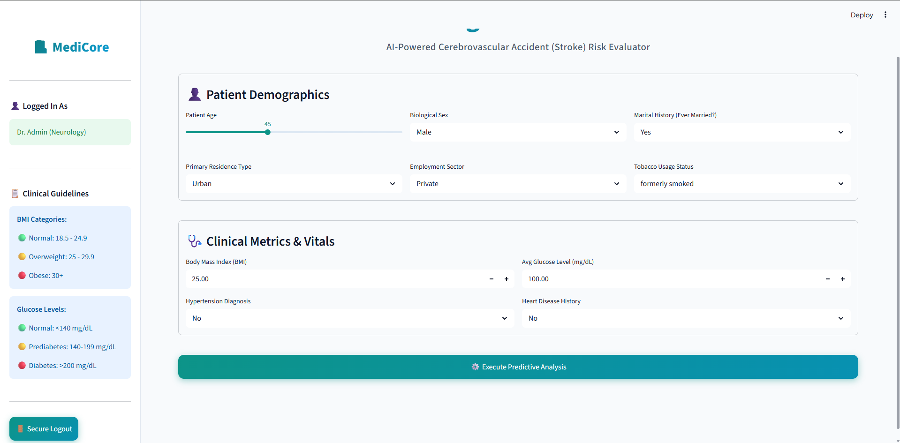

# 🏥 MediCore Systems: AI-Powered Stroke Risk Evaluator


MediCore Systems is a premium, enterprise-grade clinical dashboard designed to predict a patient's risk of suffering a Cerebrovascular Accident (Stroke). It utilizes a robust Machine Learning pipeline powered by a **Random Forest Classifier** and provides a beautifully designed UI for physicians to input patient demographics and clinical metrics.

## 📸 Platform Previews

### Secure Physician Login


### Clinical Dashboard & Prediction


## 🚀 Key Features
- **Secure Authentication Portal:** A dummy login system restricted to authorized medical personnel (`Username: admin`, `Password: 1234`).
- **Balanced ML Pipeline:** Uses a Scikit-Learn `Pipeline` combined with a `ColumnTransformer` to handle one-hot encoding, imputation, and scaling seamlessly. The Random Forest model leverages `class_weight='balanced'` to ensure high sensitivity to rare stroke events.
- **Dynamic Risk Assessment:** Flags patients as high risk if their calculated stroke probability exceeds **10%** (since the baseline general stroke risk is roughly 4%, a 10%+ risk is clinically elevated).
- **Premium UI/UX:** Built with Streamlit but heavily customized using CSS injections to achieve a sleek, Light Mode clinical aesthetic, complete with progress bars and color-coded diagnostic reports.

## 🛠️ Technology Stack
- **Frontend/UI:** [Streamlit](https://streamlit.io/) with custom CSS & `.streamlit/config.toml` overrides.
- **Data Manipulation:** Pandas, NumPy
- **Machine Learning:** Scikit-Learn (Random Forest, Pipelines, SimpleImputer, StandardScaler, OneHotEncoder)
- **Model Persistence:** Pickle

## ⚙️ How to Run Locally

1. **Clone the repository:**
   ```bash
   git clone https://github.com/preethu2896/Internship-Mini-Project.git
   cd Internship-Mini-Project
   ```

2. **Install Dependencies:**
   Ensure you have Python installed, then run:
   ```bash
   pip install pandas numpy scikit-learn streamlit
   ```

3. **Train the Model (Optional):**
   The repository already includes the pre-trained `model.pkl`. If you wish to retrain it:
   ```bash
   python train.py
   ```

4. **Launch the Application:**
   ```bash
   streamlit run app.py
   ```
   *The app will automatically open in your browser at `http://localhost:8501`.*

## 📂 Project Structure
- `app.py`: The main Streamlit web application script.
- `train.py`: The model training pipeline script.
- `stroke.ipynb`: Exploratory Data Analysis (EDA) and model prototyping notebook.
- `model.pkl`: The serialized, pre-trained Scikit-Learn Pipeline.
- `healthcare-dataset-stroke-data.csv`: The Kaggle stroke dataset used for training.
- `.streamlit/config.toml`: Forces the application into a pristine Light Mode layout.
